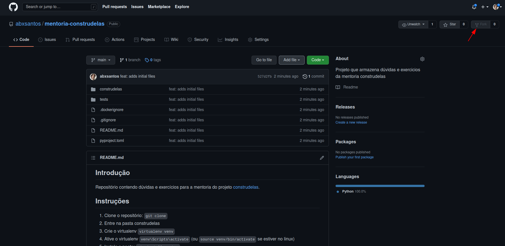
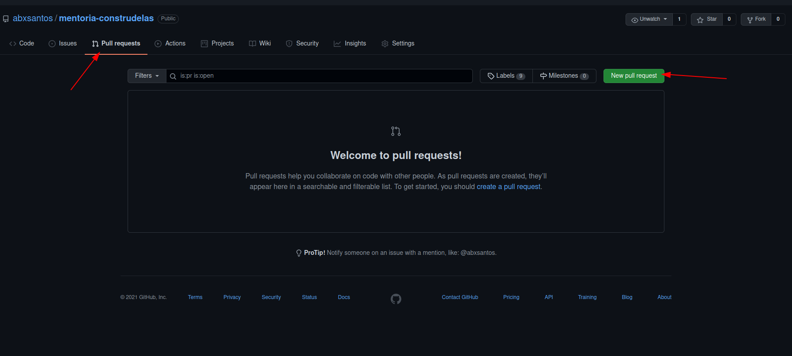

## Introdução

Repositório contendo dúvidas e exercícios para a mentoria do projeto [construdelas](https://corp.gama.academy/construdelas/inscricao).

## Instruções

1. Faça um fork do repositório.
2. Entre na pasta construdelas.
3. Crie o virtualenv `virtualenv venv`.
4. Ative o virtualenv `venv\Scripts\activate` (ou `source venv/bin/activate` se estiver no linux).
5. Instale o poetry `pip install poetry`.
6. Instale as dependências do projeto `poetry install`.
7. Adicione seu código nos módulos de exercício ou crie um novo módulo.
8. Faça os commits necessários e dê um push `git push origin main`
9. Abra um pull request com suas modificações para o repositório original.